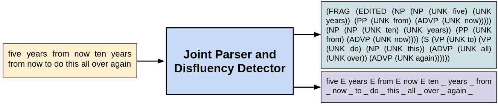

# Fisher Parse Trees and Disfluency Labels
This repo contains the code for annotating English Fisher Speech Part I and II Transcripts. Since Fisher Corpus is not open-source, we cannot release the annotated transcripts. We instead provide the recipe by which you can pre-process, annotate and obtain the fluent version of Fisher transcripts. The annotations include silver constituency parse trees and silver disfluency labels which are allocated using a state-of-the-art joint parsing and disfluency detection model (with parsing accuracy of 93.9% and disfluency detection f-score of 92.4% on Switchboard dev set), as described in [Improving Disfluency Detection by Self-Training a Self-Attentive Model](https://www.aclweb.org/anthology/2020.acl-main.346/) from ACL 2020. Since a disfluency tag is allocated to each word, you can easily have the fluent English Fisher transcripts by removing the words tagged as disfluent.

## Contents
1. [Basic Overview](#task)
2. [Software Requirements](#requirements)
3. [Using the model to annotate Fisher](#fisher-annotation)
4. [Using the model to annotate your own dataset](#others-annotation)
5. [To know more about the model](#model)
6. [Contact](#contact)
7. [Credits](#credits)

### Basic Overview


### Software Requirements
- Python 3.6 or higher.
- Cython 0.25.2 or any compatible version.
- PyTorch 0.4.1, 1.0/1.1, or any compatible version.
- pytorch-pretrained-bert 0.4.0 or any compatible version


### Using the model to annotate Fisher
To download the parser and BERT model:

```bash
$ git clone https://github.com/pariajm/english-fisher-annotations
$ cd english-fisher-annotations
$ mkdir model && cd model
$ wget https://github.com/pariajm/joint-disfluency-detector-and-parser/releases/download/naacl2019/swbd_fisher_bert_Edev.0.9078.pt
$ wget https://s3.amazonaws.com/models.huggingface.co/bert/bert-base-uncased-vocab.txt
$ wget https://s3.amazonaws.com/models.huggingface.co/bert/bert-base-uncased.tar.gz
$ tar -xf bert-base-uncased.tar.gz && cd ..
```

To parse and disfluency tag the transcripts:

```bash
$ python main.py --input-path /path/to/extracted/LDC2004T19/and/LDC2005T19 --output-path /path/to/outputs/for/saving/results --model ./model/swbd_fisher_bert_Edev.0.9078.pt 
```

Running the above command, you will end up with two types of output: 
* ```fe\_**_****\_parse.txt``` which includes Fisher constituency parse trees
* ```fe\_**_****\_dys.txt``` which contains Fisher disfluency labelled transcripts (where "\_" and "E" indicate that the previous word is fluent or disfluent, respectively). Remove the words tagged as "E" to obtain the fluent version of transcripts.


The available arguments are:

Argument | Description | Default | Required 
--- | --- | --- | ---
`--input-path` | path to extracted LDC2004T19 & LDC2005T19 | N/A | Yes
`--output-path` | output path to use for saving results | N/A | Yes
`--model-path` | path to saved .pt model | ./model/swbd_fisher_bert_Edev.0.9078.pt | No
`--disfluency` | whether disfluency tag the files | True | No


### Using the model to annotate your own dataset
You can use the repo to find silver parse trees as well as disfluency labels of your own sentences, but you probably need to modify the pre-processing part a bit!

### To know more about the model
If you want to know more about the model, read our paper cited as below and check this [repo](https://github.com/pariajm/joint-disfluency-detection-and-parsing).

### Citation
If you use this code, please cite the following paper:
```
@inproceedings{jamshid-lou-2020-improving,
    title = "Improving Disfluency Detection by Self-Training a Self-Attentive Model",
    author = "Jamshid Lou, Paria and Johnson, Mark",
    booktitle = "Proceedings of the 58th Annual Meeting of the Association for Computational Linguistics",
    month = "jul",
    year = "2020",
    address = "Online",
    publisher = "Association for Computational Linguistics",
    url = "https://www.aclweb.org/anthology/2020.acl-main.346",
    pages = "3754--3763"
}
```

### Contact
Paria Jamshid Lou <paria.jamshid-lou@hdr.mq.edu.au>

### Credits
The code for self-attentive parser is based on https://github.com/nikitakit/self-attentive-parser and the code for pre-processing Fisher is based on https://github.com/mozilla/DeepSpeech/blob/master/bin/import_fisher.py.

